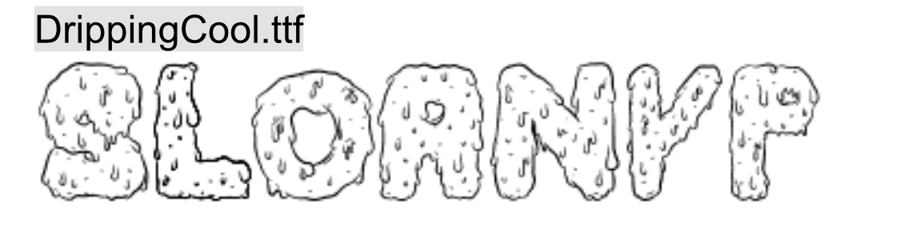

# README
## sub heading 
learning the basics of GitHub and Markdown

here is more text with line breaks

- This is how you would make 
- A bullet point list
    - Here is an idented bullet point
        1. This is an inner number 

[description of clickable link](http://www.github.com)


You can add some `variable` inline code

You can add a block of code 
```html
<p>This is a paragraph example </p>
```


How to add a picture


Paragraph with block quote
> This would be the blockquote text below the paragraph

Adding a table

| Heading | Header | Head |
| --- | --- | --- |
| Content | Content | Content |
| More | More | More |

This is an example of *italics* and **BOLD** and ~~Strike Through~~